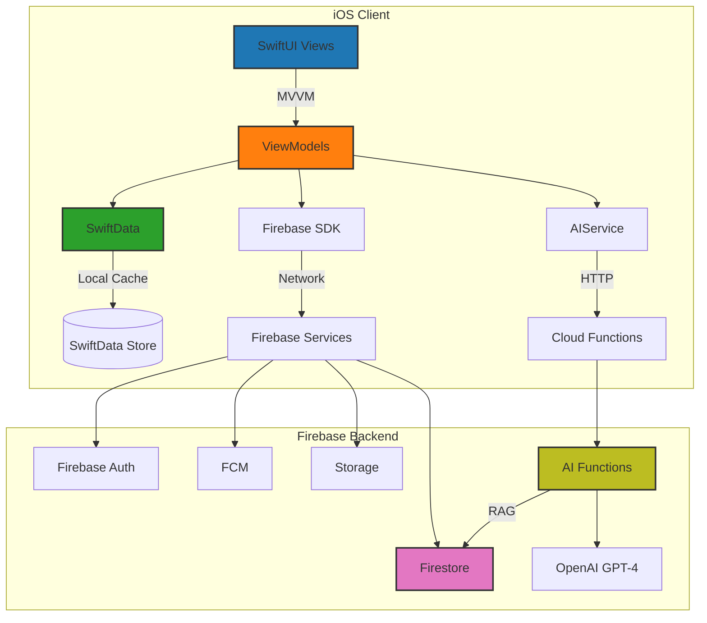
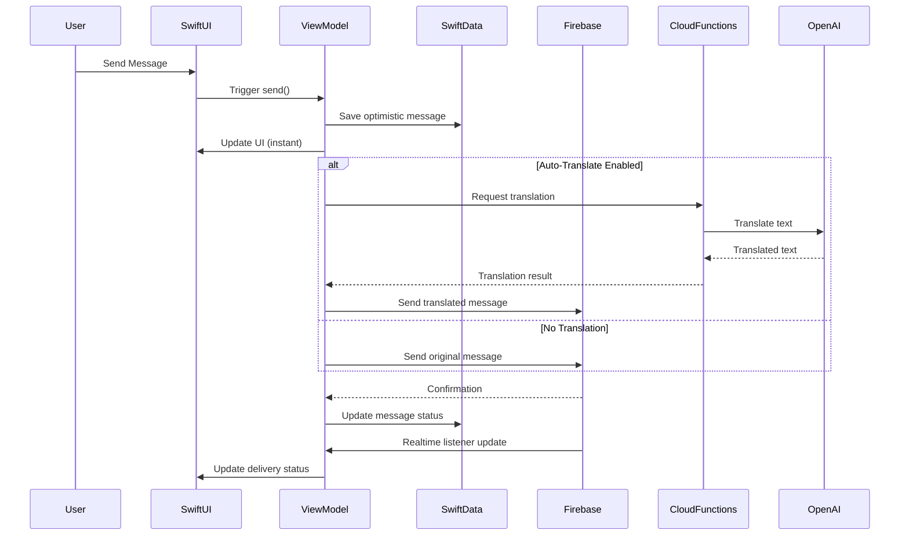
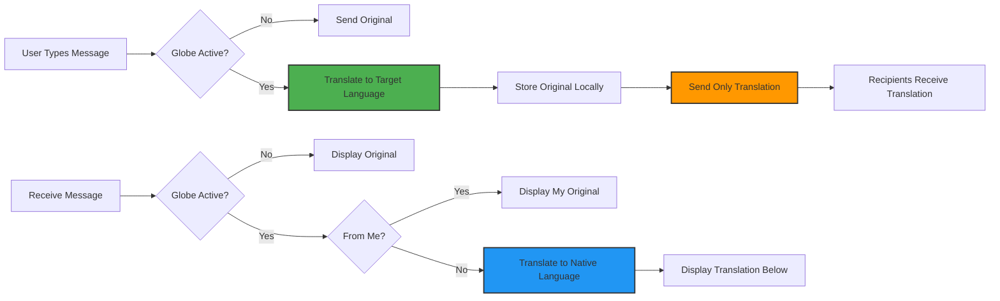
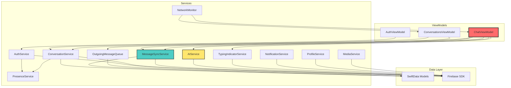

# Pingrrr 🌍💬

> A real-time messaging app for international communicators, built with Swift, SwiftUI, and Firebase

Pingrrr is an iOS messaging application designed for seamless cross-language communication. It combines real-time chat functionality with AI-powered features like translation, cultural context, and tone adjustment to break down language barriers.

[](https://developer.apple.com/ios/)
[](https://swift.org)
[](https://firebase.google.com)

## 📋 Table of Contents

- [Features](#-features)
- [Architecture](#-architecture)
- [Prerequisites](#-prerequisites)
- [Setup Instructions](#-setup-instructions)
- [Environment Configuration](#-environment-configuration)
- [Running Locally](#-running-locally)
- [Project Structure](#-project-structure)
- [Development Guidelines](#-development-guidelines)
- [Testing](#-testing)
- [Deployment](#-deployment)
- [Documentation](#-documentation)

## ✨ Features

### Core Messaging
- **Real-time Chat**: Sub-200ms message delivery with Firebase Firestore
- **One-on-One & Group Chat**: Support for 2+ users in conversations
- **Offline Support**: SwiftData persistence with queued message sends
- **Optimistic UI**: Instant message appearance before server confirmation
- **Read Receipts**: Track message delivery and read status
- **Typing Indicators**: Real-time typing status updates
- **Presence System**: Online/offline status with last seen timestamps
- **Push Notifications**: Firebase Cloud Messaging for foreground notifications
- **Media Sharing**: Image and voice message support

### AI-Powered Features (International Communicator)
1. **Auto-Translation**: Toggle globe button to translate all messages
   - Single press: Enable/disable auto-translation
   - Long press: Configure native and target languages
   - Translates incoming messages to your native language
   - Translates outgoing messages to target language
   - Recipients only see the translated version

2. **Manual Translation**: Long-press any message to translate on-demand

3. **Language Detection**: Automatically detects message language

4. **Cultural Context**: Provides cultural hints and context for better understanding

5. **Tone Adjustment**: Modify message formality (casual, neutral, formal, professional)

6. **Slang Explanation**: Get explanations for slang and idioms

7. **Smart Replies**: AI-generated context-aware reply suggestions
   - Analyzes conversation history
   - Generates replies in your native language
   - Provides translated version for sending
   - One-tap send button

8. **Message Summarization**: Summarize long conversations or message threads

### UI/UX
- **Dark Mode Design**: Signal/X-inspired interface with black backgrounds
- **60 FPS Performance**: Smooth scrolling and animations
- **Minimalist Interface**: Clean, intuitive design with blue accents
- **<2s Cold Launch**: Optimized startup time with SwiftData preloading

## 🏗 Architecture

### High-Level Overview



### Data Flow Architecture



### Message Flow with Auto-Translation



### Service Architecture



## 📦 Prerequisites

Before setting up Pingrrr, ensure you have the following installed:

### Required Software
- **Xcode 15+** ([Download](https://developer.apple.com/xcode/))
- **iOS 17+ SDK**
- **CocoaPods or Swift Package Manager** (SPM recommended)
- **Node.js 18+** and npm ([Download](https://nodejs.org/))
- **Firebase CLI** (`npm install -g firebase-tools`)
- **Git**

### Required Accounts
- **Apple Developer Account** (for running on physical devices)
- **Firebase Project** ([Create one](https://console.firebase.google.com/))
- **OpenAI API Key** ([Get one](https://platform.openai.com/api-keys))

### Firebase Services Required
- Firebase Authentication (Email/Password enabled)
- Cloud Firestore
- Cloud Functions
- Cloud Messaging
- Cloud Storage

## 🚀 Setup Instructions

### Step 1: Clone the Repository

```bash
git clone https://github.com/yourusername/pingrrr.git
cd pingrrr
```

### Step 2: Firebase Project Setup

1. **Create a Firebase Project**
   ```bash
   firebase login
   firebase projects:create pingrrr-your-id
   firebase use pingrrr-your-id
   ```

2. **Enable Required Services**
   - Go to [Firebase Console](https://console.firebase.google.com/)
   - Select your project
   - Enable Authentication → Email/Password
   - Enable Firestore Database → Start in production mode
   - Enable Cloud Functions
   - Enable Cloud Messaging
   - Enable Cloud Storage

3. **Download iOS Configuration**
   - In Firebase Console → Project Settings
   - Add iOS app with bundle ID: `com.yourcompany.pingrrr`
   - Download `GoogleService-Info.plist`
   - Place in `pingrrr/pingrrr/` directory

4. **Configure Firestore Security Rules**
   ```bash
   firebase deploy --only firestore:rules
   ```

5. **Configure Storage Security Rules**
   ```bash
   firebase deploy --only storage:rules
   ```

### Step 3: Cloud Functions Setup

1. **Navigate to Functions Directory**
   ```bash
   cd functions
   ```

2. **Install Dependencies**
   ```bash
   npm install
   ```

3. **Configure Environment Variables** (see [Environment Configuration](#-environment-configuration))

4. **Build Functions**
   ```bash
   npm run build
   ```

5. **Deploy Functions**
   ```bash
   npm run deploy
   # OR deploy specific function
   firebase deploy --only functions:aiTranslate
   ```

### Step 4: iOS Project Setup

1. **Open Xcode Project**
   ```bash
   cd ..
   open pingrrr.xcodeproj
   # OR if using workspace
   open pingrrr.xcworkspace
   ```

2. **Configure Signing & Capabilities**
   - Select `pingrrr` target
   - Go to "Signing & Capabilities"
   - Select your Team
   - Update Bundle Identifier if needed

3. **Add Required Capabilities**
   - Push Notifications
   - Background Modes → Remote notifications
   - Background Modes → Background fetch

4. **Verify Firebase SDK Integration**
   - Firebase packages should be auto-resolved via SPM
   - If not, add packages manually:
     - `https://github.com/firebase/firebase-ios-sdk`
     - Select: FirebaseAuth, FirebaseFirestore, FirebaseFunctions, FirebaseMessaging, FirebaseStorage

5. **Add GoogleService-Info.plist**
   - Drag the downloaded `GoogleService-Info.plist` into `pingrrr/pingrrr/` folder in Xcode
   - Ensure "Copy items if needed" is checked
   - Add to `pingrrr` target

### Step 5: Configure Push Notifications

1. **Generate APNs Key**
   - Go to [Apple Developer Portal](https://developer.apple.com/)
   - Certificates, Identifiers & Profiles → Keys
   - Create new key with APNs enabled
   - Download `.p8` key file

2. **Upload to Firebase**
   - Firebase Console → Project Settings → Cloud Messaging
   - Upload APNs key with Team ID and Key ID

3. **Update Info.plist**
   - Add required notification keys (already configured in project)

### Step 6: Database Indexes

Create required Firestore indexes:

```bash
firebase deploy --only firestore:indexes
```

Or manually create in Firebase Console based on `firestore.indexes.json`.

## 🔐 Environment Configuration

### Cloud Functions Environment Variables

Create a `.env` file in the `functions/` directory:

```bash
# functions/.env
OPENAI_API_KEY=sk-proj-xxxxxxxxxxxxxxxxxxxxx
```

Set Firebase environment variables:

```bash
cd functions
firebase functions:config:set openai.api_key="sk-proj-xxxxxxxxxxxxxxxxxxxxx"
```

Verify configuration:

```bash
firebase functions:config:get
```

### iOS Configuration

No additional environment variables needed. Configuration is handled through:
- `GoogleService-Info.plist` (Firebase config)
- Xcode Build Configuration
- `Info.plist` (app metadata)

### Environment Variables Template

```bash
# Firebase Project
FIREBASE_PROJECT_ID=your-project-id
FIREBASE_API_KEY=your-api-key
FIREBASE_AUTH_DOMAIN=your-project.firebaseapp.com
FIREBASE_STORAGE_BUCKET=your-project.appspot.com

# OpenAI
OPENAI_API_KEY=sk-proj-xxxxxxxxxxxxxxxxxxxxx

# iOS Bundle
BUNDLE_IDENTIFIER=com.yourcompany.pingrrr
TEAM_ID=YOUR_TEAM_ID

# APNs (for push notifications)
APNS_KEY_ID=YOUR_KEY_ID
APNS_TEAM_ID=YOUR_TEAM_ID
```

## 🏃 Running Locally

### Option 1: Xcode Simulator (Recommended for Development)

1. **Select Target Device**
   - In Xcode, select "iPhone 15 Pro" (or your preferred simulator)

2. **Build and Run**
   ```bash
   # Command line
   xcodebuild -scheme pingrrr -destination 'platform=iOS Simulator,name=iPhone 15 Pro' build
   
   # OR press Cmd+R in Xcode
   ```

3. **Create Test Users**
   - Run the app on 2+ simulators simultaneously
   - Sign up with different email addresses
   - Start chatting!

### Option 2: Physical Device

1. **Connect iPhone** via USB or WiFi

2. **Trust Developer Certificate**
   - iPhone Settings → General → VPN & Device Management
   - Trust your developer certificate

3. **Select Device in Xcode**
   - Choose your iPhone from device list

4. **Build and Run** (Cmd+R)

### Testing Push Notifications

Push notifications work differently on simulator vs device:

- **Simulator**: Only foreground notifications (iOS 16+)
- **Physical Device**: Full notification support

To test:
1. Send message while app is in foreground (toast notification)
2. Send message while app is in background (push notification)

### Running with Firebase Emulators (Optional)

For local development without consuming Firebase quota:

```bash
# Start Firebase Emulators
firebase emulators:start

# Update iOS app to use emulators (uncomment in AppDelegate.swift)
# Auth.auth().useEmulator(withHost: "localhost", port: 9099)
# Firestore.firestore().useEmulator(withHost: "localhost", port: 8080)
```

## 📁 Project Structure

```
pingrrr/
├── pingrrr/                          # iOS App
│   ├── App/                          # App lifecycle & entry point
│   │   ├── AppDelegate.swift         # Firebase initialization
│   │   ├── AppMain.swift             # App entry point
│   │   └── RootContainerView.swift   # Root container with auth routing
│   │
│   ├── Models/                       # Data models
│   │   ├── ChatModels.swift          # SwiftData models (Message, Conversation, etc.)
│   │   └── TranslationLanguage.swift # Translation language definitions
│   │
│   ├── Views/                        # SwiftUI Views
│   │   ├── AuthenticationFlowView.swift # Login/signup
│   │   ├── ConversationsView.swift   # Chat list
│   │   ├── ChatView.swift            # Chat interface with AI features
│   │   ├── SettingsSheet.swift       # User settings
│   │   └── Components/               # Reusable UI components
│   │
│   ├── ViewModels/                   # Business logic
│   │   ├── AuthViewModel.swift       # Authentication state
│   │   ├── ConversationsViewModel.swift # Conversations list logic
│   │   ├── ChatViewModel.swift       # Chat logic & AI features
│   │   └── TypingIndicatorService.swift # Typing indicators
│   │
│   ├── Services/                     # Backend integration
│   │   ├── AuthService.swift         # Firebase Auth wrapper
│   │   ├── ConversationService.swift # Conversation CRUD
│   │   ├── ConversationsSyncService.swift # Firestore sync
│   │   ├── MessageSyncService.swift  # Message sync & persistence
│   │   ├── AIService.swift           # AI features coordinator
│   │   ├── PresenceService.swift     # Online/offline status
│   │   ├── NotificationService.swift # FCM integration
│   │   ├── MediaService.swift        # Image/voice upload
│   │   ├── OutgoingMessageQueue.swift # Offline message queue
│   │   ├── NetworkMonitor.swift      # Network connectivity
│   │   └── ProfileService.swift      # User profile management
│   │
│   ├── Extensions/                   # Swift extensions
│   ├── Assets.xcassets/              # Images & icons
│   └── Info.plist                    # App configuration
│
├── functions/                        # Firebase Cloud Functions
│   ├── src/
│   │   ├── index.ts                  # Functions entry point
│   │   └── ai/                       # AI feature implementations
│   │       ├── translate.ts          # Translation
│   │       ├── detectLang.ts         # Language detection
│   │       ├── culturalHint.ts       # Cultural context
│   │       ├── adjustTone.ts         # Tone adjustment
│   │       ├── explainSlang.ts       # Slang explanation
│   │       ├── smartReplies.ts       # Smart reply generation
│   │       ├── summarize.ts          # Conversation summarization
│   │       ├── assistant.ts          # AI assistant
│   │       └── common.ts             # Shared utilities
│   │
│   ├── package.json                  # Node dependencies
│   └── tsconfig.json                 # TypeScript config
│
├── memory-bank/                      # Project documentation
│   ├── projectbrief.md               # Project overview
│   ├── PRD.md                        # Product requirements
│   ├── techContext.md                # Technical architecture
│   ├── systemPatterns.md             # Design patterns
│   ├── MVPcriticalrequirements.md    # MVP checklist
│   └── progress.md                   # Development progress
│
├── scripts/                          # Utility scripts
│   ├── set_user_tier.sh              # User tier management
│   └── lookup_uid.sh                 # User ID lookup
│
├── firebase.json                     # Firebase configuration
├── firestore.rules                   # Firestore security rules
├── firestore.indexes.json            # Firestore indexes
├── storage.rules                     # Storage security rules
└── README.md                         # This file
```

## 👨‍💻 Development Guidelines

### Code Style

- **Swift**: Follow [Swift API Design Guidelines](https://swift.org/documentation/api-design-guidelines/)
- **SwiftUI**: Use declarative patterns, avoid imperative code
- **Naming**: Clear, descriptive names; avoid abbreviations
- **Comments**: Document complex logic, algorithms, and public APIs

### Architecture Patterns

1. **MVVM (Model-View-ViewModel)**
   - Views: Pure SwiftUI, no business logic
   - ViewModels: Business logic, state management, async operations
   - Models: Data structures (SwiftData models)

2. **Service Layer**
   - Services handle external dependencies (Firebase, AI)
   - Single responsibility principle
   - Injected into ViewModels

3. **Async/Await**
   - Use Swift Concurrency for all async operations
   - Avoid completion handlers
   - Proper error handling with `do-catch`

### State Management

- **@Published**: For ViewModel properties that drive UI
- **@State**: For local view state
- **@StateObject**: For ViewModel initialization
- **@ObservedObject**: For passed ViewModels
- **@EnvironmentObject**: For app-wide state (AuthViewModel)

### Performance Best Practices

1. **SwiftUI Optimization**
   - Use `LazyVStack` for long lists
   - Avoid expensive computations in view body
   - Use `@ViewBuilder` for conditional views
   - Extract subviews to reduce recomputation

2. **SwiftData**
   - Use `@Query` with predicates for filtering
   - Batch operations when possible
   - Optimize fetch descriptors

3. **Firebase**
   - Limit Firestore listener scope
   - Use indexed queries
   - Batch writes for multiple operations
   - Implement pagination for large datasets

4. **AI Features**
   - Cache translations for repeated content
   - Debounce user interactions
   - Show loading states
   - Implement timeout handling

### Error Handling

```swift
// Example: Proper error handling pattern
func sendMessage() async {
    do {
        try await viewModel.send(request: .text(message))
        // Success handling
    } catch NetworkError.offline {
        errorMessage = "No internet connection. Message queued."
    } catch AIError.rateLimitExceeded {
        errorMessage = "AI usage limit reached. Try again later."
    } catch {
        errorMessage = "Failed to send message: \(error.localizedDescription)"
    }
}
```

### Testing Guidelines

1. **Unit Tests**: Test ViewModels and Services
2. **Integration Tests**: Test Firebase interactions
3. **UI Tests**: Test critical user flows
4. **Manual Testing**: Test on multiple devices and iOS versions

## 🧪 Testing

### Unit Testing

Run unit tests via Xcode:

```bash
# Command line
xcodebuild test -scheme pingrrrTests -destination 'platform=iOS Simulator,name=iPhone 15 Pro'

# OR press Cmd+U in Xcode
```

### Integration Testing

Test scenarios to verify:

1. **Real-time Messaging**
   - Send message between 2 devices
   - Verify <200ms delivery on good network

2. **Offline Support**
   - Enable Airplane Mode
   - Send messages (queued)
   - Disable Airplane Mode
   - Verify messages sync

3. **App Lifecycle**
   - Force quit app
   - Reopen
   - Verify messages persisted

4. **Group Chat**
   - Create 3+ user conversation
   - Send messages from each user
   - Verify all receive messages

5. **AI Features**
   - Test each AI feature (translate, tone, smart reply, etc.)
   - Verify <2s response time
   - Test with various languages

6. **Performance**
   - Send 20+ rapid messages
   - Verify smooth scrolling
   - Check memory usage

### Manual Testing Checklist

- [ ] Sign up new user
- [ ] Sign in existing user
- [ ] Create conversation
- [ ] Send text message
- [ ] Send image
- [ ] Send voice message
- [ ] Receive message (foreground notification)
- [ ] Receive message (background push)
- [ ] Toggle online status
- [ ] See typing indicator
- [ ] View read receipts
- [ ] Enable auto-translate
- [ ] Configure translation languages
- [ ] Use manual translation
- [ ] Generate smart reply
- [ ] Adjust message tone
- [ ] Explain slang
- [ ] Get cultural context
- [ ] Summarize conversation
- [ ] Test offline → online transition
- [ ] Test poor network conditions

## 🚢 Deployment

### TestFlight Deployment

1. **Archive Build**
   - Xcode → Product → Archive
   - Wait for archive to complete

2. **Distribute to App Store Connect**
   - Select archive → Distribute App
   - Choose "App Store Connect"
   - Upload build

3. **Configure TestFlight**
   - Go to [App Store Connect](https://appstoreconnect.apple.com/)
   - Select your app → TestFlight
   - Add internal testers
   - Create external test group (optional)

4. **Submit for Review** (external testing)
   - Add test information
   - Submit for review
   - Wait for approval (~24 hours)

### Firebase Deployment

Deploy all Firebase resources:

```bash
# Deploy everything
firebase deploy

# Deploy specific services
firebase deploy --only functions
firebase deploy --only firestore:rules
firebase deploy --only storage:rules
firebase deploy --only firestore:indexes
```

### Production Checklist

- [ ] Update version number in Xcode
- [ ] Update build number
- [ ] Test on multiple iOS versions (17, 18)
- [ ] Test on multiple device sizes (iPhone SE, Pro, Pro Max)
- [ ] Verify all Firebase functions deployed
- [ ] Verify Firestore indexes created
- [ ] Test push notifications on physical device
- [ ] Review and update security rules
- [ ] Enable Firebase App Check (recommended)
- [ ] Set up Crashlytics (optional)
- [ ] Configure analytics (optional)
- [ ] Update App Store metadata
- [ ] Prepare screenshots
- [ ] Write release notes

## 📚 Documentation

### Additional Documentation Files

- **[Project Brief](memory-bank/projectbrief.md)**: High-level overview and objectives
- **[PRD](PRD.md)**: Detailed product requirements and specifications
- **[Tech Context](memory-bank/techContext.md)**: Technical architecture and patterns
- **[System Patterns](memory-bank/systemPatterns.md)**: Design patterns and conventions
- **[MVP Requirements](MVPcriticalrequirements.md)**: Critical MVP checklist
- **[MVP Tasks](MVPtasks.md)**: Development tasks and progress
- **[Progress](memory-bank/progress.md)**: Development timeline and achievements

### API Documentation

#### ChatViewModel Public API

```swift
// Send message
await viewModel.send(request: .text("Hello"))

// Toggle auto-translate
viewModel.toggleAutoTranslate()

// Update translation languages
viewModel.updateAutoTranslateLanguages(native: .en, target: .es)

// AI Features
await viewModel.translateMessage(for: messageID, to: "es")
await viewModel.generateSmartReply(for: messageID)
await viewModel.adjustTone(for: messageID, to: .formal)
await viewModel.explainSlang(for: messageID)
await viewModel.provideCulturalContext(for: messageID)
await viewModel.summarizeConversation()
```

#### AIService Public API

```swift
// Translation
let result = try await AIService.shared.translate(text: text, to: targetLang)

// Language detection
let lang = try await AIService.shared.detectLanguage(text: text)

// Smart replies
let replies = try await AIService.shared.smartReplies(history: history, native: lang)

// Cultural context
let context = try await AIService.shared.culturalContext(text: text, lang: lang)
```

### Firestore Data Structure

```
firestore/
├── users/
│   └── {userId}/
│       ├── uid: string
│       ├── email: string
│       ├── displayName: string
│       ├── photoURL: string?
│       ├── bio: string?
│       ├── onlineStatus: "online" | "offline"
│       ├── lastSeen: timestamp
│       ├── fcmToken: string?
│       └── aiUsageToday: number
│
├── conversations/
│   └── {conversationId}/
│       ├── participantIDs: [string]
│       ├── participantNames: {userId: string}
│       ├── participantPhotos: {userId: string}
│       ├── lastMessageText: string
│       ├── lastMessageAt: timestamp
│       ├── lastMessageBy: string
│       ├── unreadCounts: {userId: number}
│       ├── typingUsers: {userId: timestamp}
│       ├── translationPreferences: {userId: {enabled, native, target, activatedAt}}
│       └── createdAt: timestamp
│
└── messages/
    └── {messageId}/
        ├── conversationID: string
        ├── senderID: string
        ├── senderName: string
        ├── content: string (translated if auto-translate on)
        ├── originalContent: string? (sender's original text)
        ├── timestamp: timestamp
        ├── mediaType: "image" | "voice"?
        ├── mediaURL: string?
        ├── voiceDuration: number?
        ├── status: "sending" | "sent" | "delivered" | "read"
        ├── readBy: {userId: timestamp}
        ├── translatedContent: string? (manual translation)
        ├── autoTranslations: {
        │   "broadcast": {text, targetLanguageCode},
        │   userId: {text, targetLanguageCode}
        │ }
        └── aiInsights: {
            slangExplanation: string?,
            culturalContext: string?,
            summary: string?
          }
```

## 🐛 Troubleshooting

### Common Issues

**Build Failed: GoogleService-Info.plist not found**
- Download from Firebase Console
- Drag into Xcode project
- Ensure added to target

**Push Notifications Not Working**
- Verify APNs key uploaded to Firebase
- Check capabilities enabled in Xcode
- Test on physical device (not simulator)
- Verify FCM token registered

**Messages Not Syncing**
- Check Firebase rules allow read/write
- Verify internet connection
- Check Firestore indexes created
- Review Firebase Console logs

**AI Features Failing**
- Verify OPENAI_API_KEY set in Cloud Functions
- Check Cloud Functions deployed
- Review function logs: `firebase functions:log`
- Verify usage limits not exceeded

**App Crashes on Launch**
- Check Firebase initialized properly
- Verify GoogleService-Info.plist configuration
- Review Xcode console for errors
- Check SwiftData migration issues

## 🤝 Contributing

1. Fork the repository
2. Create a feature branch (`git checkout -b feature/amazing-feature`)
3. Commit your changes (`git commit -m 'Add amazing feature'`)
4. Push to the branch (`git push origin feature/amazing-feature`)
5. Open a Pull Request

## 📄 License

This project is licensed under the MIT License - see the LICENSE file for details.

## 🙏 Acknowledgments

- Firebase for backend infrastructure
- OpenAI for AI capabilities
- Vercel AI SDK for streamlined AI integration
- Apple for Swift and SwiftUI
- Signal and X for UI/UX inspiration

## 📞 Support

For issues, questions, or feedback:
- Open an issue on GitHub
- Email: support@pingrrr.app
- Twitter: [@pingrrr](https://twitter.com/pingrrr)

---

Built with ❤️ for international communicators worldwide 🌍

